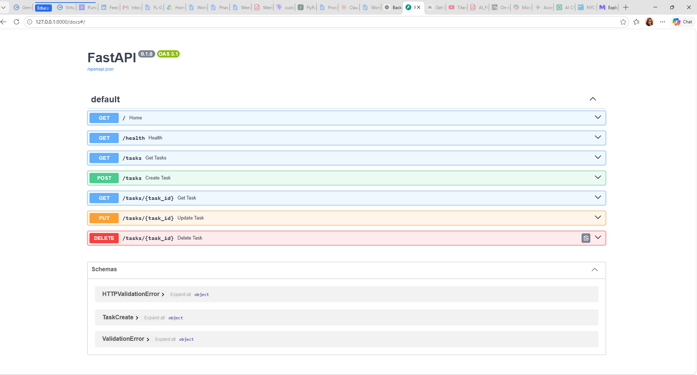

# Task API

A simple CRUD API for managing tasks, built with Python and FastAPI.

## Run the API

Start the server with:

```powershell
& "$env:LocalAppData\Programs\Python\Python313\python.exe" -m uvicorn main:app --reload


👉 **Put the Endpoints section immediately after that Swagger line.**

One small thing: because the README contains a code block, make sure the endpoint table is **outside** the code block. ❤️

## curl -i Example

## Swagger UI



```text
HTTP/1.1 200 OK
date: Sun, 20 Sep 2026 22:31:55 GMT
server: uvicorn
content-length: 15
content-type: application/json

{"status":"ok"}


Those three backticks **close the code block**.

Then below it:

```markdown
## Swagger UI


## Project Structure

```text
Backend-AI-Engineering/
├── main.py
├── README.md
├── swagger.png
└── .gitignore