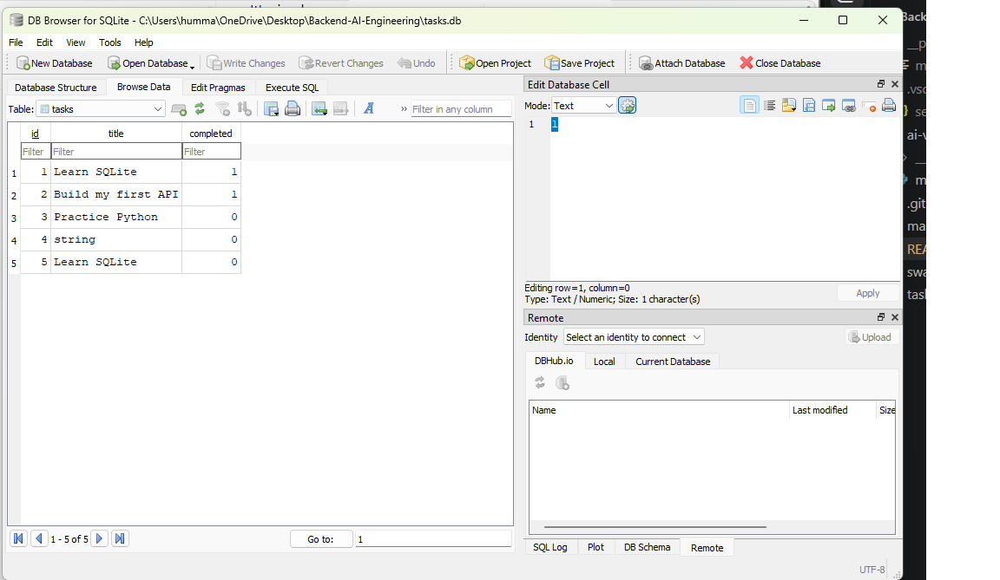

# Task API

A simple CRUD API for managing tasks, built with Python and FastAPI.

## Run the API

Start the server with:

```powershell
& "$env:LocalAppData\Programs\Python\Python313\python.exe" -m uvicorn main:app --reload
```

The API will run at `http://127.0.0.1:8000`.

Swagger UI is available at `http://127.0.0.1:8000/docs`.

## Endpoints

| Method | Endpoint           | Description     |
| ------ | ------------------ | --------------- |
| GET    | `/`                | Welcome message |
| GET    | `/health`          | Health check    |
| GET    | `/tasks`           | List all tasks  |
| POST   | `/tasks`           | Create a task   |
| GET    | `/tasks/{task_id}` | Get one task    |
| PUT    | `/tasks/{task_id}` | Update a task   |
| DELETE | `/tasks/{task_id}` | Delete a task   |

## curl -i Example

```text
HTTP/1.1 200 OK
date: Sun, 20 Sep 2026 22:31:55 GMT
server: uvicorn
content-length: 15
content-type: application/json

{"status":"ok"}
```

## Swagger UI


## Database Viewer

The SQLite database was inspected using DB Browser for SQLite.



## Project Structure

```text
Backend-AI-Engineering/
├── main.py
├── tasks.db
├── README.md
├── swagger.png
├── database.png
└── .gitignore
```

## Response Status Codes

* `200 OK` — Successful GET and PUT requests
* `201 Created` — Task successfully created
* `204 No Content` — Task successfully deleted
* `400 Bad Request` — Invalid or missing task title
* `404 Not Found` — Task ID does not exist

## AI vs Me

### My original version vs. AI version

I first built the Task API myself, then gave an AI assistant my own prompt to build the same API. I tested the AI-generated version before comparing it with my version.

#### Difference 1: Endpoints

My version includes `/` and `/health` in addition to the five CRUD endpoints. The AI version only included the five CRUD endpoints because my Stage 7 prompt did not mention `/` or `/health`.

#### Difference 2: Task structure

My version uses a `completed` boolean field and starts with three sample tasks. The first AI version used a `done` field and started with an empty task list. My prompt did not specify the exact field name or initial tasks, so the AI made those decisions itself.

#### Difference 3: Validation

My version includes a custom validation handler so invalid request bodies return `400`. The first AI version correctly returned `400` for an empty title, but a missing title would use FastAPI's default `422` validation response. My prompt was not specific enough about how missing-title validation should be handled.

### What AI did better

The AI version used a separate `next_id` counter to assign task IDs. I understand that this keeps track of the next ID and increases it after each new task. This is more reliable when tasks are deleted.

### What AI got wrong or ignored

The first AI version did not fully handle a missing title as a `400` error. FastAPI would return `422` for that case, which did not match my requirement.

### What my prompt forgot

My original prompt did not specify the exact task fields, initial sample tasks, `/` and `/health` endpoints, or the exact JSON error format. The AI made its own decisions for those details.

### One rematch

I improved my prompt by explicitly specifying the task fields, three starting tasks, a separate `next_id` counter, and `400` handling for both missing and empty titles.

The improved prompt produced a version that matched these requirements more closely.